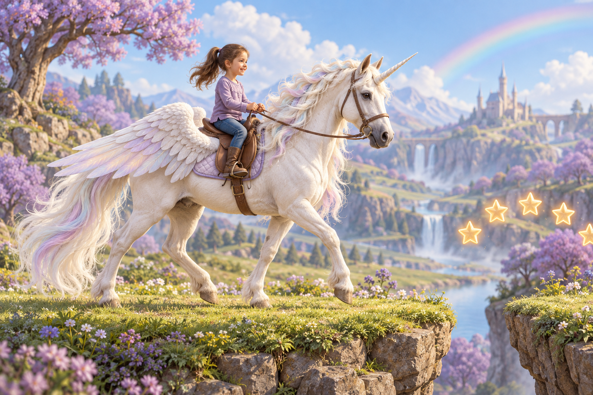

# Molly och den magiska enhörningen

## Uppdrag och godkända beslut

Utveckla ett enkelt plattformsspel som går att spela i en webbläsare på dator och surfplatta. Spelaren styr en enhörning med ryttaren Molly, en sexårig flicka. De ska kunna röra sig framåt, hoppa, flyga korta stunder och använda magi samtidigt som de undviker faror.

Användaren har godkänt den senaste konceptbilden som visuell riktning. Den ligger i `assets/design-reference.png`. Bilden är ett designförslag, inte en färdig spelgrafik eller animationsserie.

Användaren har nu uttryckligen beställt en ny utvecklingssession som sätter upp GitHub-projektet och fortsätter tills spelet går att köra. Tidigare fokus på enbart förslag före implementation är därmed avslutat.

## Visuell riktning

- Naturtrogen sagostil med naturliga proportioner, synlig päls, man och fjädrar. Undvik emoji och enkla geometriska figurer som slutlig karaktärsgrafik.
- Molly ska tydligt vara ett barn på sex år. Konceptbilden visar brunt hår i hästsvans, lila tröja, blå byxor och ridstövlar.
- Enhörningen är vit med horn, ljus skimrande man och svans samt fjädervingar. Molly sitter på dess rygg; de styrs som en gemensam spelkaraktär.
- Tvådimensionellt spel från sidan med djup genom bakgrundslager. Behåll den godkända bilden som referens för färger, ljus och material.
- Första miljön kan vara Regnbågsängen: gräsplattformar, blommande träd, en regnbåge och stjärnor att samla. Detaljerad planering av flera banor är inte nödvändig för första versionen.

## Kontroller

| Handling | Tangentbord | Surfplatta |
| --- | --- | --- |
| Röra sig åt vänster/höger | Vänster/höger piltangent | Två riktningsknappar till vänster |
| Hoppa | Mellanslag | Stor hoppknapp till höger |
| Flyga kort efter hoppet | Håll mellanslag | Håll hoppknappen |
| Använda magi | X | Separat magiknapp |

Använd inga alternativa A/D-kontroller. Tangentbordet ska använda piltangenter, mellanslag och X. Uppåt/nedåt har ingen bestämd funktion.

Pekstyrningen ska stödja flera fingrar samtidigt, så att spelaren kan styra och hoppa/flyga samtidigt. Hantera släppta knappar, avbrutna pekningar och förlorat fokus utan att en rörelse fastnar. Spelytan ska inte scrolla vid styrning. Placera knappar så att de inte täcker karaktären eller viktiga faror. Liggande läge är huvudläget på surfplatta; anpassa storlek och placering till skärmen.

## Första spelbara versionen

- En sammanhängande kort bana/testmiljö med start och tydligt mål, till exempel en regnbågsportal.
- Rörelse, hopp, kollisioner med mark/plattformar och kortvarig flygning med begränsad flygkraft.
- En tydlig magiförmåga, exempelvis en magipuff som tar bort vissa hinder, med enkel återhämtning mellan användningarna.
- Stjärnor att samla och några tydliga faror, såsom hål och taggar.
- Enkel hälsa och snabb omstart vid misslyckande; tydligt vinstläge och möjlighet att spela igen.
- Lekfull, vänlig stämning och begriplig svensk speltext.
- Karaktärsgrafik i godkänd stil som fungerar i rörelse. Skapa separata lämpliga spelbilder vid behov; använd inte hela konceptbilden som en ersättning för själva spelet.

## Teknik, GitHub och publicering

- Spelet körs på spelarens enhet i webbläsaren. Första versionen behöver ingen egen spelserver, användarinloggning, databas eller AI-anrop under spelandet.
- Välj en enkel lösning för 2D, exempelvis Canvas/JavaScript eller en lämplig liten spelmotor. Prioritera fungerande spel, responsiv styrning och underhållbar kod.
- Samla källkod, spelbilder, plan och körinstruktioner i detta projekt. Använd GitHub för versionshistorik och GitHub Pages som första publiceringsmål.
- För ett GitHub Free-upplägg med Pages blir projektets kod offentlig, enligt den plan användaren har godkänt. Om användarens befintliga plan medger annan önskad lösning kan den användas. Lägg inte in hemligheter eller autentiseringsuppgifter i projektet.
- GitHub-reponamnet kan vara `molly-unicorn`, eller ett tillgängligt närliggande namn. Kontrollera befintliga resurser innan något skapas så att samma projekt inte dubbleras.
- Använd inte OpenAI Sites som publiceringsmål. GitHub Pages är vald lösning; Sites dokumentation anger dessutom en begränsning för tjänster som riktar sig till barn under 13 år.

## Genomförande

1. Kontrollera arbetsmiljö och GitHub-anslutning. Skapa eller återanvänd GitHub-projektet och lokal Git-historik för denna projektmapp.
2. Skapa spelkaraktär och miljögrafik med konceptbilden som referens, samt en första fungerande spelyta.
3. Implementera tangentbord och pekstyrning tillsammans med rörelse, hopp och flygning.
4. Lägg till magi, samlarobjekt, faror, mål och omstart.
5. Testa faktisk spelbarhet, kollisioner, vinst/förlust, omstart och båda styrsätten. Kontrollera datorstorlek och surfplattestorlek, inklusive samtidiga pekningar när testverktygen tillåter det.
6. Skriv korta svenska körinstruktioner. Spara och pusha fungerande kod till GitHub och publicera med GitHub Pages när autentisering och kontorättigheter tillåter det.

## Klart när

- Spelet faktiskt går att starta och spela i en webbläsare med Molly på enhörningen.
- Piltangenter, mellanslag och X fungerar enligt planen.
- Surfplattans pekknappar fungerar och kan användas samtidigt.
- Hopp, flygning, magi, samlarobjekt, faror, mål och omstart fungerar.
- Körinstruktionerna är verifierade och projektet har versionshistorik.
- GitHub-projekt och en spelbar publicerad länk levereras om kontoåtkomst medger det. Om GitHub-inloggning eller publicering blockeras, färdigställ och verifiera det lokalt körbara spelet ändå, och ange exakt vilket steg som kräver användarens åtgärd. Beskriv aldrig en overifierad publicering som klar.

## Avgränsning

Ingen multiplayer, butik, konton, annonser eller avancerad backend i första versionen. Målet är ett riktigt, spelbart första spel med den godkända visuella riktningen, inte enbart en skiss eller startsida.
